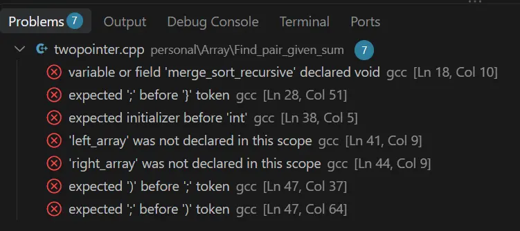
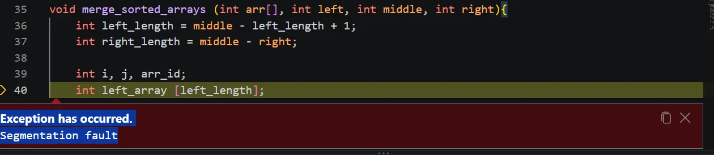
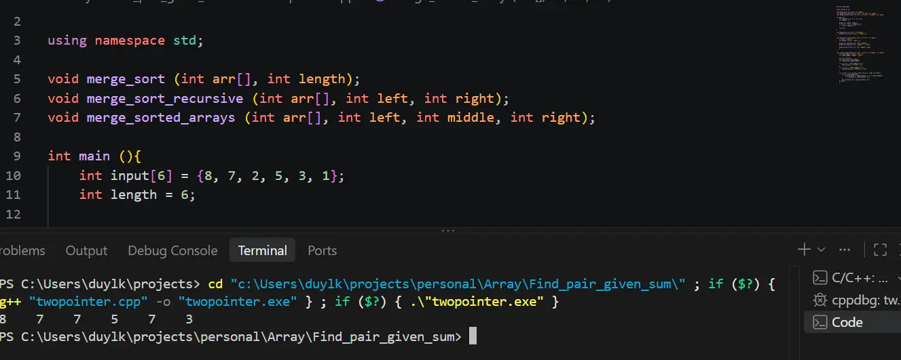
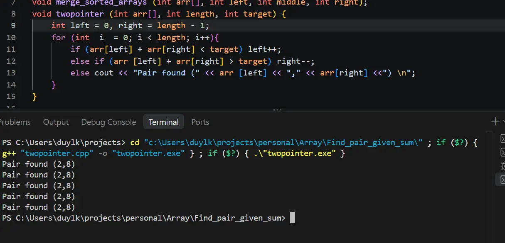
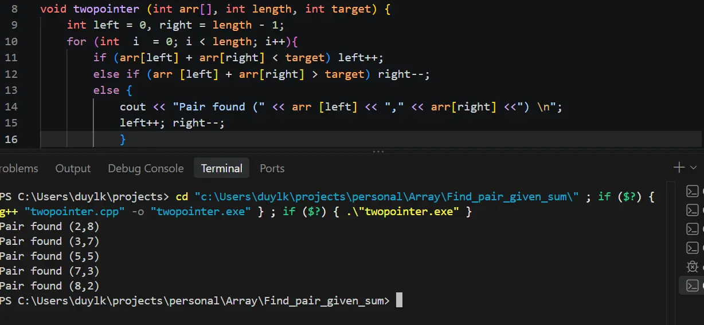
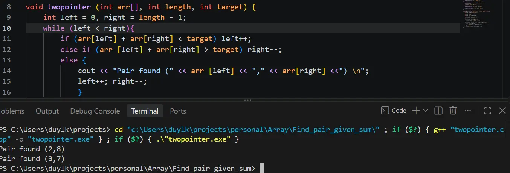

## Problem

Given an array of integers and a target sum, find a pair of elements whose sum equals the target.

Example:

```text

Array:  [8, 7, 2, 5, 3, 1]

Target: 10

```

Output:

```text

Pair found (8,2) 
Pair found (7,3) 

```

## Approaches
### 1. Brute Force
- The brute-force approach worked correctly on my first attempt, so there was no significant debugging process to document for this implementation.
---

### 2. Sorting + Two Pointers
1. Syntax error
	- Since I was not allowed to use the standard `<algorithm>` library, I implemented `merge_sort` from scratch. I chose Merge Sort because it maintains the optimal `O(n log n)` time complexity for the sorting step.
	
		_Takeaway:_ I needed to be much more careful with syntax and variable declarations while writing custom sorting algorithms. _(Note: TIL you can initialize multiple variables in a loop header)_

2. Programming problem in Sorting
	- The program compiled after fixing the syntax error, but it did not produce any output. This was more difficult to debug because `merge_sort` is recursive. Fortunately, the VS Code debugger helped identify the problem..
		_Resolution:_ I realized `left_length` wasn't highlighting properly because of the problem with the initialization of it.
	- Well, it is still consider a syntax error, so pretty easy to solve. A logic one on the other hand... (a second logic bug appeared during the merge step:)

	- To be totally honest, I have no clue where the 7s come out, and where did my 2 and 1 go. Because the 7s got more, I think some stuffs happened with my loop, or my math, (out of bound, or negative number...) so that where I goes next.
		
		**Resolution**:_ Due to tunnel vision, I accidentally wrote `right_length = middle - right`. Correcting the index math resolved the unexpected output values.
3. Programming problem in Two_pointer
	- This an easy one, but also a funny one, I found the solution, but not really. The loop made it clear that once it found the solution, I forget to put further instruction on what to do, and so it just staying in the same spot for another, and another loop. Solving this to ensure it only return the solution one is easy, but as you can see, it's missing another pair.
	- The first thing that I thought to solve is the additional pair one, simply add `left++; right--` is enough to make sure it goes and search for a new pair. However, it definitely did not solve the duplication problem.
	- A quick trick for this is to use a `while` loop instead of for (because with having more than one pair, you can not possible know how many loops it would need). The condition is  `left < right`.
		
